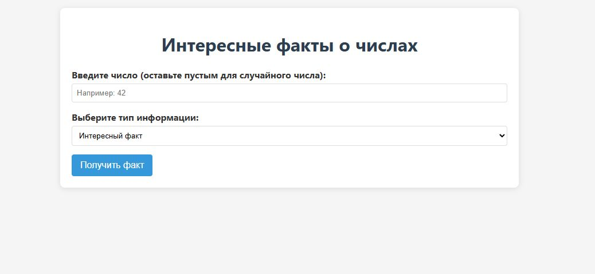

# Number Facts App



Простое одностраничное приложение для отображения интересных фактов о числах, датах и годах с использованием [NumbersAPI](http://numbersapi.com).

## 🌟 Особенности

- Получение фактов о числах (математических, тривиальных)
- Факты о датах в формате месяц/день (например, 12/31)
- Факты о годах
- Возможность запроса случайного числа
- Валидация ввода и обработка ошибок
- Адаптивный дизайн

## 🚀 Быстрый старт

1. Клонируйте репозиторий:

```bash
git clone https://github.com/RaiHammer/number-facts-app.git
```

2. Откройте index.html в браузере

## 🛠 Использование

Введите число (или оставьте пустым для случайного)

Выберите тип факта:

Trivia - интересные факты

Math - математические факты

Date - факты о датах (формат: месяц/день)

Year - факты о годах

Нажмите "Получить факт"

Примеры запросов:

42 + Math → "42 is a pronic number."

7/4 + Date → "July 4th is Independence Day in the United States."

(пусто) + Trivia → Случайный факт о случайном числе

## 🛠 Технологии

HTML5, CSS3, Vanilla JavaScript

NumbersAPI (http://numbersapi.com)

Адаптивный дизайн (mobile-friendly)